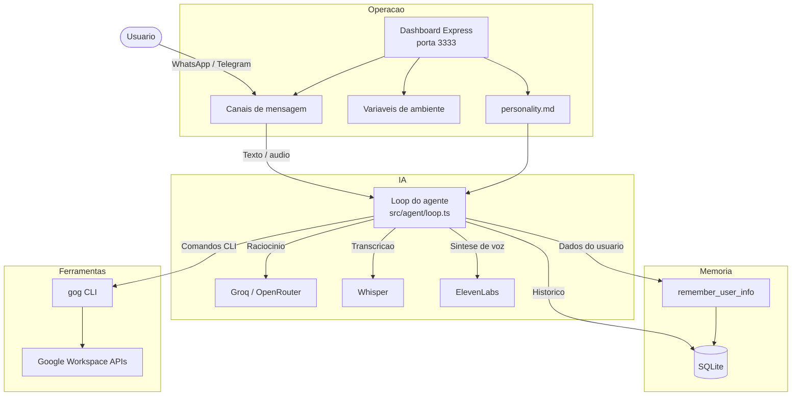

# AgenteJuridicoFlexeiras

[](https://www.typescriptlang.org/)
[](https://nodejs.org/)
[](https://expressjs.com/)
[](https://sqlite.org/)
[](https://www.docker.com/)

Assistente de inteligencia artificial em TypeScript para apoio juridico e administrativo em contexto municipal. O projeto integra atendimento por WhatsApp e Telegram, memoria persistente, transcricao de audio, sintese de voz, ferramentas do Google Workspace e uma base juridica configuravel.

Foi desenhado para execucao local ou em VPS com Docker, mantendo credenciais, sessoes de atendimento, banco de dados e demais dados operacionais fora do versionamento.

> Este repositorio contem software e padroes de configuracao para um assistente de IA. Ele nao substitui parecer juridico, interpretacao oficial da administracao publica ou validacao profissional especializada.

---

## Visao Geral

| Area | Recursos |
| --- | --- |
| Raciocinio de IA | Loop agentico no estilo ReAct, com chamada de ferramentas e limite de iteracoes |
| Canais | WhatsApp via Baileys e Telegram via Grammy |
| Audio | Transcricao de mensagens de voz e respostas opcionais em audio |
| Memoria | Historico conversacional e informacoes persistentes de perfil em SQLite |
| Ferramentas | Integracao com Gmail, Calendar, Drive e Contacts via `gog` CLI |
| Operacao | Dashboard web para status, configuracoes e conexao do WhatsApp |
| Deploy | Suporte a Docker e Docker Compose para ambiente local ou VPS |

---

## Arquitetura



---

## Estrutura do Projeto

```text
.
├── src/                    # Codigo-fonte TypeScript
├── dashboard/              # Interface web de operacao
├── eliza/
│   ├── AgenteEliza.md      # Base juridica consolidada
│   └── Legislação/         # Arquivos originais das leis municipais
├── contexto/CONTEXTO.md    # Historico tecnico e operacional do projeto
├── personality.md          # Persona e contexto ativo do agente
├── docker-compose.yml      # Orquestracao principal
├── Dockerfile              # Imagem de producao
├── .env.example            # Modelo de variaveis de ambiente
└── README.md               # Documentacao publica do projeto
```

---

## Base de Conhecimento

O comportamento ativo do agente e carregado a partir do arquivo `personality.md`. A aplicacao relê esse arquivo a cada nova mensagem recebida; por isso, mudancas de persona ou conhecimento entram em vigor sem rebuild da imagem Docker e sem reiniciar o servico.

| Arquivo ou pasta | Funcao |
| --- | --- |
| `eliza/Legislação/` | Fontes originais das leis, usadas como trilha documental |
| `eliza/AgenteEliza.md` | Referencia juridica e institucional consolidada |
| `personality.md` | Contexto operacional efetivamente usado pelo agente |
| `contexto/CONTEXTO.md` | Registro tecnico, historico e notas de manutencao |

Legislacoes municipais atualmente contempladas:

- Lei 412/2009: regime juridico dos servidores publicos.
- Lei 503/2019: atualizacoes sobre processo administrativo-disciplinar.
- Lei 523/2021: reestruturacao do RPPS/FUNPREFEX.
- Lei 525/2021: alteracoes estatutarias sobre beneficios e licencas.
- Lei 566/2022: regime de previdencia complementar.
- Lei 620/2025: contribuicao patronal para o regime proprio de previdencia.

---

## Requisitos

- Node.js 20 ou superior.
- npm.
- Docker e Docker Compose para deploy em container.
- Credenciais dos provedores e canais habilitados.
- Opcional: `gog` CLI para integracoes com Google Workspace.

---

## Configuracao

Crie o arquivo local de ambiente a partir do modelo:

```bash
cp .env.example .env
```

Variaveis principais:

```env
TELEGRAM_BOT_TOKEN=
TELEGRAM_ALLOWED_USER_IDS=

GROQ_API_KEY=
OPENROUTER_API_KEY=
OPENROUTER_MODEL=

DB_PATH=./memory.db
GOG_ACCOUNT=

WHATSAPP_ENABLED=true
WHATSAPP_ALLOWED_NUMBERS=

ELEVENLABS_API_KEY=
ELEVENLABS_VOICE_ID=
```

Arquivos sensiveis como `.env`, bancos SQLite, sessoes do WhatsApp e credenciais OAuth sao ignorados pelo Git.

---

## Execucao Local

Instale as dependencias:

```bash
npm install
```

Inicie em modo de desenvolvimento:

```bash
npm run dev
```

O dashboard fica disponivel em:

```text
http://localhost:3333
```

No dashboard e possivel verificar status dos provedores, configurar credenciais quando aplicavel, acompanhar a conexao do WhatsApp e escanear o QR Code de autenticacao.

---

## Deploy com Docker

Subir ou reconstruir o servico:

```bash
docker compose up -d --build
```

Acompanhar logs:

```bash
docker compose logs -f
```

Parar os containers:

```bash
docker compose down
```

A sessao do WhatsApp e mantida em pasta persistente. Rebuilds ou restarts nao exigem nova conexao, desde que a pasta de sessao seja preservada e o volume continue montado.

---

## Atualizacao da Base Juridica

1. Adicionar a fonte oficial em `eliza/Legislação/`.
2. Revisar e extrair os dispositivos juridicamente relevantes.
3. Atualizar `eliza/AgenteEliza.md` com a consolidacao completa.
4. Atualizar `personality.md` com o resumo operacional usado pelo agente.
5. Validar o projeto antes de publicar.

Comando recomendado de validacao:

```bash
node node_modules/typescript/bin/tsc --noEmit
```

Quando a alteracao envolver apenas `personality.md`, nao e necessario rebuild do Docker.

---

## Validacao da Base Juridica

Apos atualizar `personality.md` e `eliza/AgenteEliza.md`, recomenda-se testar o agente pelo mesmo canal usado em producao. As perguntas abaixo ajudam a confirmar se o bot esta lendo a base juridica atualizada e se diferencia corretamente leis, regimes e contribuicoes.

| Tema | Pergunta de teste | Resposta esperada |
| --- | --- | --- |
| Lei 620/2025 | `Dra. Eliza, com base na Lei Municipal nº 620/2025, qual é a alíquota da contribuição patronal normal do Município para o RPPS/FUNPREFEX, e essa lei mudou a contribuição do servidor ativo?` | Deve informar contribuicao patronal normal de 14%, vinculada a remuneracao de contribuicao, e esclarecer que a lei trata da contribuicao patronal, sem alterar diretamente a contribuicao do servidor ativo. |
| Leis 523/2021 e 620/2025 | `Dra. Eliza, diferencie as contribuições previdenciárias do RPPS/FUNPREFEX para servidor ativo, aposentado/pensionista e ente patronal, considerando as Leis Municipais 523/2021 e 620/2025.` | Deve distinguir servidor ativo, aposentado/pensionista e ente patronal: ativo com 14% sobre remuneracao de contribuicao; aposentado/pensionista com 14% apenas sobre a parcela acima do teto do RGPS; ente patronal com 14% como contribuicao normal. |
| Lei 566/2022 | `Dra. Eliza, pela Lei Municipal nº 566/2022, o que acontece com o servidor que ingressar depois da instituição do Regime de Previdência Complementar e tiver remuneração acima do teto do RGPS?` | Deve mencionar inscricao automatica no plano complementar, possibilidade de desistencia em ate 90 dias e restituicao das contribuicoes conforme regulamento. |
| Lei 525/2021 | `Dra. Eliza, depois da Lei Municipal nº 525/2021, como fica a readaptação do servidor público municipal de Flexeiras?` | Deve indicar limitacao fisica ou mental, avaliacao por junta medica oficial, cargo compativel, manutencao da remuneracao do cargo de origem e requisitos de escolaridade. |
| Lei 503/2019 | `Dra. Eliza, conforme a Lei Municipal nº 503/2019, qual é o prazo para conclusão do processo administrativo disciplinar e como funciona a composição da comissão?` | Deve apontar prazo de ate 60 dias, prorrogavel por igual periodo, comissao com no minimo 3 servidores estaveis, presidente com escolaridade igual ou superior a do indiciado, ampla defesa e contraditorio. |

Esses testes nao substituem revisao juridica. Eles funcionam como verificacao operacional da memoria ativa do agente apos manutencao da base.

---

## Seguranca

- Nunca versionar `.env`, chaves de API, sessoes do WhatsApp, bancos SQLite ou credenciais OAuth.
- Usar `WHATSAPP_ALLOWED_NUMBERS` quando o ambiente nao for estritamente controlado.
- Manter chaves de provedores com escopo minimo e rotaciona-las em caso de exposicao.
- Revisar respostas juridicas geradas por IA antes de utiliza-las em atos formais ou orientacoes oficiais.

---

## Licenca

Este repositorio ainda nao possui arquivo de licenca. Inclua uma licenca antes de distribuir, reutilizar ou derivar este projeto fora do seu contexto operacional autorizado.
