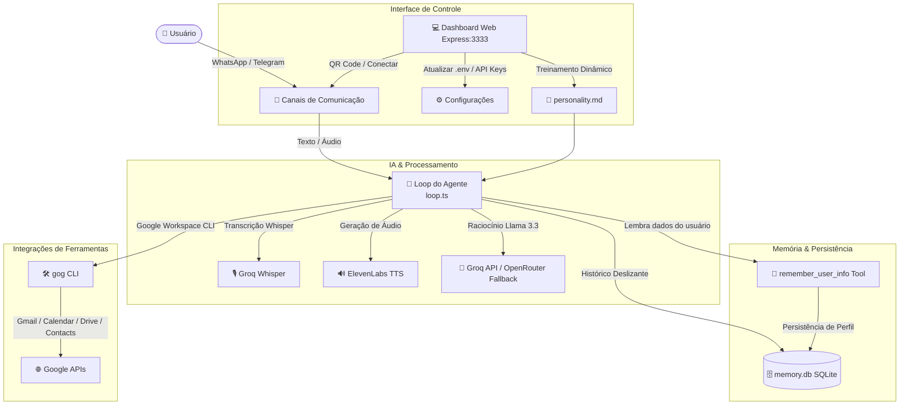

# ⚡ AgenteJuridicoFlexeiras

[](https://www.typescriptlang.org/)
[](https://nodejs.org/)
[](https://expressjs.com/)
[](https://sqlite.org/)
[](https://www.docker.com/)
[](https://groq.com/)

O **AgenteJuridicoFlexeiras** é um ecossistema completo de agentes de Inteligência Artificial especializados, autônomos e multi-persona de alta performance. Projetado para rodar localmente ou em servidores virtuais privados (VPS), ele oferece uma arquitetura de IA capaz de automatizar tarefas cotidianas e responder dúvidas complexas através de um poderoso **loop cognitivo ReAct**, integrando-se nativamente a canais de comunicação populares como **WhatsApp** e **Telegram**, e a ferramentas de produtividade do **Google Workspace**.

Este projeto demonstra padrões de engenharia de software de ponta para aplicações de IA, incluindo function calling nativo, fallbacks automáticos de LLM, memória persistente relacional de longo prazo, transcrição de áudio assíncrona, síntese de voz natural e um painel de controle web de auto-configuração.

---

## 📐 Arquitetura do Sistema

O fluxo de processamento do agente ilustra como as mensagens são recebidas, interpretadas através de um loop de raciocínio lógico em TypeScript, e como ele interage dinamicamente com APIs, banco de dados local e ferramentas externas:



---

## 🚀 Diferenciais Agenticos e Tecnologias

### 1. Loop Cognitivo ReAct & Function Calling
No núcleo do sistema (`src/agent/loop.ts`), o agente não responde simplesmente ao usuário, mas realiza um processo iterativo de raciocínio. Ao receber uma mensagem, ele consulta suas ferramentas e decide se precisa usá-las para responder com precisão. O loop processa até **5 iterações de pensamento**, executando ferramentas sequencialmente (como buscar emails e depois consultar a agenda) antes de formular a resposta final.

### 2. Integração Profunda com Google Workspace
Através do utilitário de terminal `gog` (Google Workspace CLI), o agente possui superpoderes de produtividade sem a complexidade de códigos OAuth verbosos. As ferramentas mapeadas no agente incluem:
*   **Gmail (`gmail_search`, `gmail_send`):** Permite ao agente buscar emails não lidos, ler conteúdos de mensagens importantes e enviar e-mails de resposta diretamente da conversa do WhatsApp ou Telegram.
*   **Google Calendar (`calendar_list_events`, `calendar_create_event`):** Lista compromissos futuros e agenda novos eventos automaticamente.
*   **Google Drive (`drive_search`):** Pesquisa por documentos, planilhas ou relatórios salvos no Drive do usuário.
*   **Google Contacts (`contacts_list`):** Acessa contatos salvos para obter e-mails ou informações de envio.

### 3. Memória Persistente Dinâmica (SQLite)
O agente utiliza o SQLite via `better-sqlite3` para gerenciar dois tipos de memórias cruciais:
*   **Memória de Curto Prazo (Janela Deslizante):** Armazena as últimas 50 mensagens trocadas com cada usuário para manter o contexto imediato da conversa.
*   **Memória de Longo Prazo (Perfil do Usuário):** Através da ferramenta `remember_user_info`, a LLM detecta automaticamente quando o usuário revela fatos sobre si (nome, cargo, cidade, preferências de café da manhã) e os salva no banco de dados. Essas informações são reinjetadas em tempo de execução no prompt de sistema, garantindo que o agente lembre de detalhes cruciais permanentemente.

### 4. Multicanal Avançado com Áudio Bidirecional
*   **WhatsApp (Baileys):** Conectividade direta via WebSocket. O agente aceita mensagens de áudio, baixa o buffer, transcreve com o modelo **Whisper Large v3** da Groq de forma ultra-rápida, processa o texto no loop do agente e, se o usuário pedir voz (ex: *"Responda por áudio..."*), gera um arquivo de fala perfeito através do **ElevenLabs v2 Multilingual** e envia de volta como áudio nativo (estilo gravador de voz).
*   **Telegram (Grammy):** Robusto bot rodando via long-polling com autorização seletiva por ID de usuário no `.env`.

### 5. Dashboard Web de Auto-Gestão
Desenvolvido em Express.js com um frontend limpo em Vanilla JS/CSS, o painel disponível na porta `3333` permite:
*   Visualizar a saúde e o status de conexão de todas as chaves de API (Telegram, Groq, ElevenLabs, Google).
*   Carregar arquivos de credenciais OAuth para a CLI do Google.
*   Acompanhar o status do WhatsApp e escanear o **QR Code** para autenticação diretamente na tela.
*   Realizar o upload de novas personalidades (`personality.md`) para mudar o comportamento e área de especialidade da IA em tempo real.

---

## 🛠️ Stack Tecnológica

*   **Linguagem:** TypeScript (Node.js 22 rodando em modo nativo ESM com `tsx`)
*   **Banco de Dados:** SQLite (`better-sqlite3`)
*   **Framework Web:** Express.js + Vanilla HTML5/CSS3 (Dashboard integrado)
*   **Comunicações:** `@whiskeysockets/baileys` (WhatsApp), `grammy` (Telegram)
*   **Modelos de IA:**
    *   *Groq (Principal):* Llama 3.3 70B Versatile (Raciocínio), Whisper Large v3 (Transcrição de voz)
    *   *OpenRouter (Fallback):* Llama 3/Modelos gratuitos (Garante resiliência caso a API da Groq fique fora do ar ou sem saldo)
    *   *ElevenLabs:* Eleven Multilingual v2 (Síntese de voz hiper-realista)
*   **Orquestração & Deploy:** Docker & Docker Compose

---

## ⚙️ Configuração do Ambiente (`.env`)

Copie o arquivo `.env.example` para `.env` e preencha as variáveis de ambiente necessárias:

```env
# ── CONFIGURAÇÕES DO TELEGRAM ──
TELEGRAM_BOT_TOKEN=seu_token_de_bot_do_telegram
TELEGRAM_ALLOWED_USER_IDS=123456789,987654321 # IDs permitidos a interagir (separados por vírgula)

# ── PROVEDORES DE INTELIGÊNCIA ARTIFICIAL (LLMs) ──
GROQ_API_KEY=gsk_... # Chave API da Groq Cloud
OPENROUTER_API_KEY=sk-or-v1-... # Chave API de Fallback do OpenRouter
OPENROUTER_MODEL=openrouter/free # Modelo a ser usado no OpenRouter (ex: google/gemini-2.5-flash)

# ── BANCO DE DADOS ──
DB_PATH=./memory.db # Caminho para o arquivo do banco de dados SQLite

# ── CONTA GOOGLE (INTEGRAÇÕES DE TOOLS) ──
GOG_ACCOUNT=seu_email_google@gmail.com

# ── CONFIGURAÇÕES DO WHATSAPP ──
WHATSAPP_ENABLED=true # Habilitar/Desabilitar o canal do WhatsApp
WHATSAPP_ALLOWED_NUMBERS=5511999999999,5511988888888 # Deixe vazio para público, ou adicione a whitelist

# ── SÍNTESE DE VOZ (ELEVENLABS) ──
ELEVENLABS_API_KEY=sua_chave_elevenlabs
ELEVENLABS_VOICE_ID=cgSgspJ2msm6clMCkdW9 # ID da voz preferida
```

---

## 🚀 Instalação e Execução

Você pode rodar o **AgenteJuridicoFlexeiras** localmente em modo de desenvolvimento ou empacotado em produção usando Docker.

### Método 1: Execução Local (NPM + tsx)

#### Pré-requisitos
Certifique-se de possuir o Node.js v20+ e NPM instalados no sistema.

1.  **Instale as dependências do projeto:**
    ```bash
    npm install
    ```
2.  **Configure o utilitário Google CLI (Gog) - Opcional:**
    Instale a CLI `gog` em sua máquina conforme as instruções de [gogcli.sh](https://gogcli.sh). Com suas credenciais OAuth do Google prontas, você pode configurar o acesso via terminal:
    ```bash
    gog auth credentials /caminho/para/seu/client_secret.json
    gog auth add seu_email_google@gmail.com --services gmail,calendar,drive,contacts,docs,sheets
    ```
    *(Nota: você também pode fazer essa configuração de autenticação do Google e upload das credenciais diretamente no Dashboard Web).*
3.  **Rode o servidor em modo de desenvolvimento:**
    ```bash
    npm run dev
    ```
    Isso iniciará o dashboard Express na porta `3333`, o bot do Telegram e a conexão com o WhatsApp.

---

### Método 2: Deploy Recomendado com Docker (VPS / Portainer)

Esta é a abordagem ideal para servidores Linux Debian/Ubuntu em nuvem, garantindo a persistência do banco de dados e do cache da autenticação do WhatsApp em volumes isolados.

1.  **Inicie os contêineres em segundo plano:**
    ```bash
    docker compose up -d --build
    ```
2.  **Monitore a inicialização através dos logs:**
    ```bash
    docker compose logs -f
    ```
3.  **Acesse o Dashboard:**
    Abra seu navegador e digite `http://localhost:3333` (ou o IP público da sua VPS). No painel web, você poderá:
    *   Verificar se a sua chave Groq e token do Telegram estão configurados.
    *   Visualizar o QR Code gerado em tempo real e escaneá-lo com seu celular para conectar o WhatsApp do agente.
    *   Personalizar o bot dinamicamente.

---

## 🔧 Base Jurídica, Treinamento e Comportamento

A personalidade, limitações e base de conhecimento ativa do bot são carregadas do arquivo `personality.md` na raiz do projeto. O agente lê esse arquivo a cada nova mensagem recebida, então alterações em `personality.md` entram em vigor **sem rebuild e sem reiniciar a aplicação**.

### Organização da Base da Dra. Eliza

*   **Fontes originais:** os PDFs oficiais das leis ficam em `eliza/Legislação/`. Eles servem como arquivo-fonte e trilha de auditoria, mas o agente não lê PDFs automaticamente em tempo de execução.
*   **Base canônica consolidada:** `eliza/AgenteEliza.md` guarda a versão documental mais completa da Dra. Eliza, com estatuto, previdência, regras disciplinares e contexto institucional.
*   **Base ativa do agente:** `personality.md` contém o resumo operacional que é injetado no prompt do agente. Este é o arquivo que precisa estar atualizado para que o WhatsApp/Telegram respondam com a nova base.
*   **Documentação do projeto:** `contexto/CONTEXTO.md` descreve arquitetura, deploy e histórico operacional. Ele não é usado pelo agente como base de resposta.

### Legislações Municipais Cobertas

*   **Lei nº 412/2009:** Regime Jurídico dos Servidores Públicos de Flexeiras/AL.
*   **Lei nº 503/2019:** Altera regras do processo administrativo-disciplinar, incluindo prazos e composição da comissão.
*   **Lei nº 523/2021:** Reestrutura o RPPS/FUNPREFEX, incluindo contribuição do servidor ativo, aposentados e pensionistas, benefícios previdenciários, aposentadorias, pensão por morte e abono de permanência.
*   **Lei nº 525/2021:** Altera dispositivos do estatuto sobre readaptação, salário-família, auxílio-doença, auxílio-reclusão, licença saúde, licença gestante e licença por adoção.
*   **Lei nº 566/2022:** Institui o Regime de Previdência Complementar (RPC), regra do teto do RGPS, inscrição automática, desistência e contribuição paritária.
*   **Lei nº 620/2025:** Fixa a contribuição patronal normal em 14% sobre a remuneração de contribuição, nos termos do art. 17, III, da Lei nº 523/2021.

### Fluxo para Atualizar a Base Jurídica

1.  Salve o PDF oficial em `eliza/Legislação/`.
2.  Extraia e revise os pontos normativos relevantes da lei.
3.  Atualize `eliza/AgenteEliza.md` com a base consolidada.
4.  Atualize `personality.md` com o resumo operacional que o agente deve usar nas respostas.
5.  Em produção Docker, envie apenas o `personality.md` atualizado quando a mudança for só de conhecimento/persona. Como o `docker-compose.yml` monta `./personality.md:/app/personality.md`, não é necessário rebuild.

### Observação sobre WhatsApp

Atualizar `personality.md` não derruba a sessão do WhatsApp. Mesmo em caso de restart/rebuild, a sessão tende a permanecer conectada porque `./whatsapp-session` é montado como volume persistente. A conexão só deve ser refeita se a pasta `whatsapp-session/` for removida, se o dashboard mandar desconectar, ou se o container subir sem esse volume.

---

## 🔒 Segurança e Práticas Recomendadas

O projeto foi estruturado sob fortes diretrizes de segurança de código:
*   **.gitignore Estrito:** Todos os arquivos de credenciais do Google, tokens confidenciais do `.env`, histórico de mensagens do `memory.db` e sessões ativas do WhatsApp (`whatsapp-session/`) são ignorados de forma rígida para que nunca sejam expostos no GitHub público.
*   **Modo Isolado no WhatsApp:** Whitelist opcional ativada por meio de `WHATSAPP_ALLOWED_NUMBERS` no arquivo de ambiente, impedindo que pessoas não autorizadas acionem as ferramentas de IA ou consumam seus créditos de API.
*   **Limites de Execução:** Loop cognitivo com trava em 5 iterações para prevenir loops infinitos e estouro de gastos na API da Groq.

---
*AgenteJuridicoFlexeiras — Criado para rodar a IA que resolve tarefas com inteligência e autonomia.*
